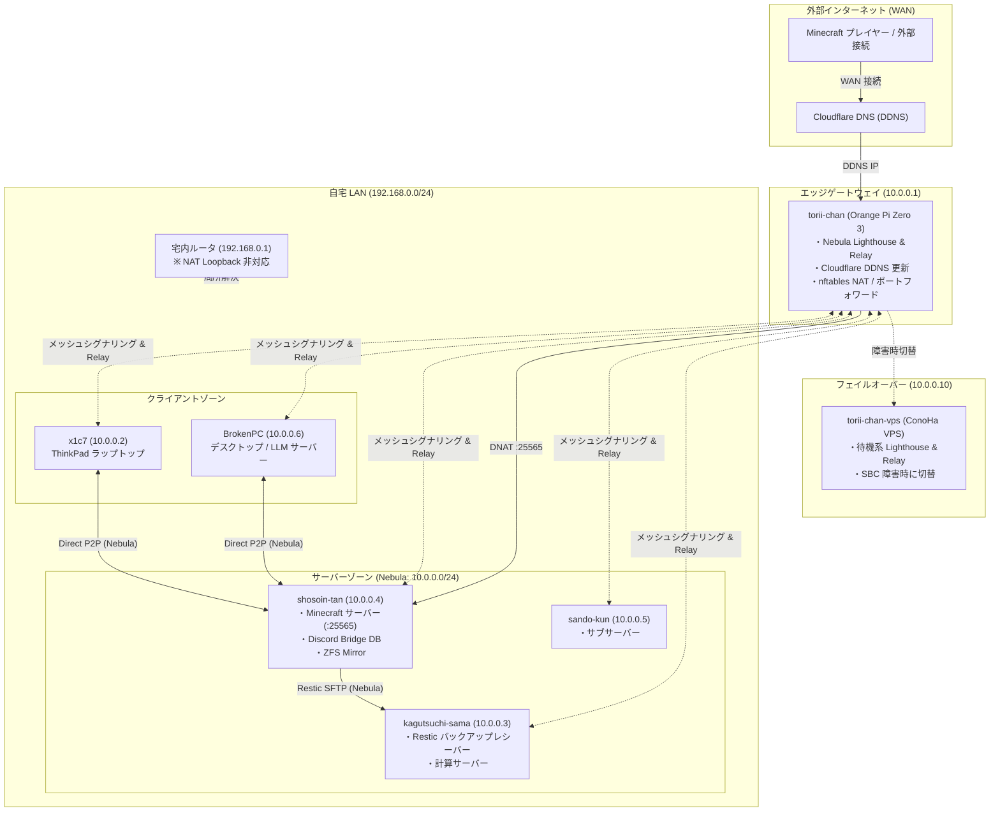

# ネットワークアーキテクチャ

本ドキュメントは，本リポジトリで管理されている全ホスト間のオーバーレイネットワーク（Nebula），WAN/LAN 接続経路，ポートフォワーディング，およびセキュリティ境界の設計仕様を記述する．

---

## 1. ネットワーク全体トポロジ

全ホストは **Nebula メッシュ VPN**（`10.0.0.0/24`, MTU 1320）によって相互接続されている．外部インターネット（WAN）からの公開トラフィックは，エッジゲートウェイ（`torii-chan`）経由で安全に内部サーバーへルーティングされる．

---

## 2. Nebula IP アロケーション台帳

全ノードは `10.0.0.0/24` のプライベートアドレス空間に配置されている．

| ホスト名 | Nebula IP | ロール / グループ | 役割・用途 |
| :--- | :--- | :--- | :--- |
| **`torii-chan`** | `10.0.0.1` | `lighthouse`, `relay`, `gateway` | プライマリ Lighthouse & Relay，WAN NAT ゲートウェイ |
| **`x1c7`** | `10.0.0.2` | `client`, `mgmt` | モバイルラップトップ（ThinkPad X1C7） |
| **`kagutsuchi-sama`** | `10.0.0.3` | `server`, `mgmt`, `backup-receiver` | 計算サーバー，Restic リモートバックアップ保管庫 |
| **`shosoin-tan`** | `10.0.0.4` | `server`, `mgmt`, `app` | Minecraft サーバー，Discord Bridge，ZFS ストレージ |
| **`sando-kun`** | `10.0.0.5` | `server`, `mgmt` | サブサーバー |
| **`BrokenPC`** | `10.0.0.6` | `workstation`, `mgmt` | メインワークステーション，ローカル LLM サーバー |
| **`torii-chan-vps`** | `10.0.0.10` | `lighthouse`, `relay`, `vps` | ConoHa VPS 上の待機系フェイルオーバーゲートウェイ |

---

## 3. 主要なネットワーク機構

### 3.1 P2P メッシュ通信と Relay
- **Lighthouse**: `torii-chan`（10.0.0.1）がパブリックな固定ポート（UDP 4242）を監視し，ノード間のディスカバリを行う．
- **Direct P2P**: 同一 LAN 内（または直接疎通可能な WAN 間）のノード同士は，UDP ホールパンチングにより Lighthouse を介さず直接暗号化通信（P2P）を行う．
- **Relay**: 直接通信が困難な NAT 背後のノード同士は，`torii-chan` を中継局（Relay）としてトラフィックを転送する．

### 3.2 Cloudflare DDNS と ポートフォワーディング
- `torii-chan` 上で稼働する Cloudflare DDNS サービスが，動的グローバル IPv4 アドレスを検知して A レコードを自動更新する．
- `nixos/services/gateway/default.nix`（nftables）により，外部から受信した Minecraft ポート（TCP 25565）は LAN 内の `shosoin-tan`（`10.0.0.4:25565`）へ透過的に DNAT 転送される．

### 3.3 NAT Loopback 回避 (`local-network.nix`)
- 自宅 LAN の上位ルータが NAT Loopback（ヘアピン NAT）に対応していないため，LAN 内端末から外部ドメインへアクセスすると接続が遮断される．
- これを解決するため，LAN 内ノードは `nixos/networking/local-network.nix` を介して，自宅向けドメインを LAN 内の直接 IP（`192.168.0.128`）へ静的に名前解決（hosts 登録）する．

---

## 4. セキュリティ境界（Security Boundary）

1. **SSH の Nebula 閉じ込め**:
   - サーバー群（`shosoin-tan`, `kagutsuchi-sama`, `sando-kun`）の SSH ポートは，物理 LAN や WAN から遮断され，**`nebula0` インターフェース（`10.0.0.0/24`）からのみリッスン・接続を許可** している．
   - これにより，外部からの不正アクセスや LAN 内の他デバイスからの不要な侵入リスクを最小化している．
2. **ゾーン分離**:
   - Nebula 証明書に含まれるグループ（`groups`）に基づき，ファイアウォールルールでアクセス制限を実施している（例: 管理用トラフィックは `mgmt` のみ許可）．
3. **証明書の有効期限と年次更新**:
   - Nebula ルート CA は 10年有効だが，各ノードの証明書は **1年有効** である．更新手順は [`../operations/secret-management.md`](../operations/secret-management.md) を参照．

---

## 関連ドキュメント
- [リポジトリ全体アーキテクチャ](overview.md)
- [シークレット & 証明書管理](../operations/secret-management.md)
- [VPS フェイルオーバー手順](../operations/vps-failover.md)
- [ネットワーク障害トラブルシューティング](../troubleshooting/network-recovery.md)
