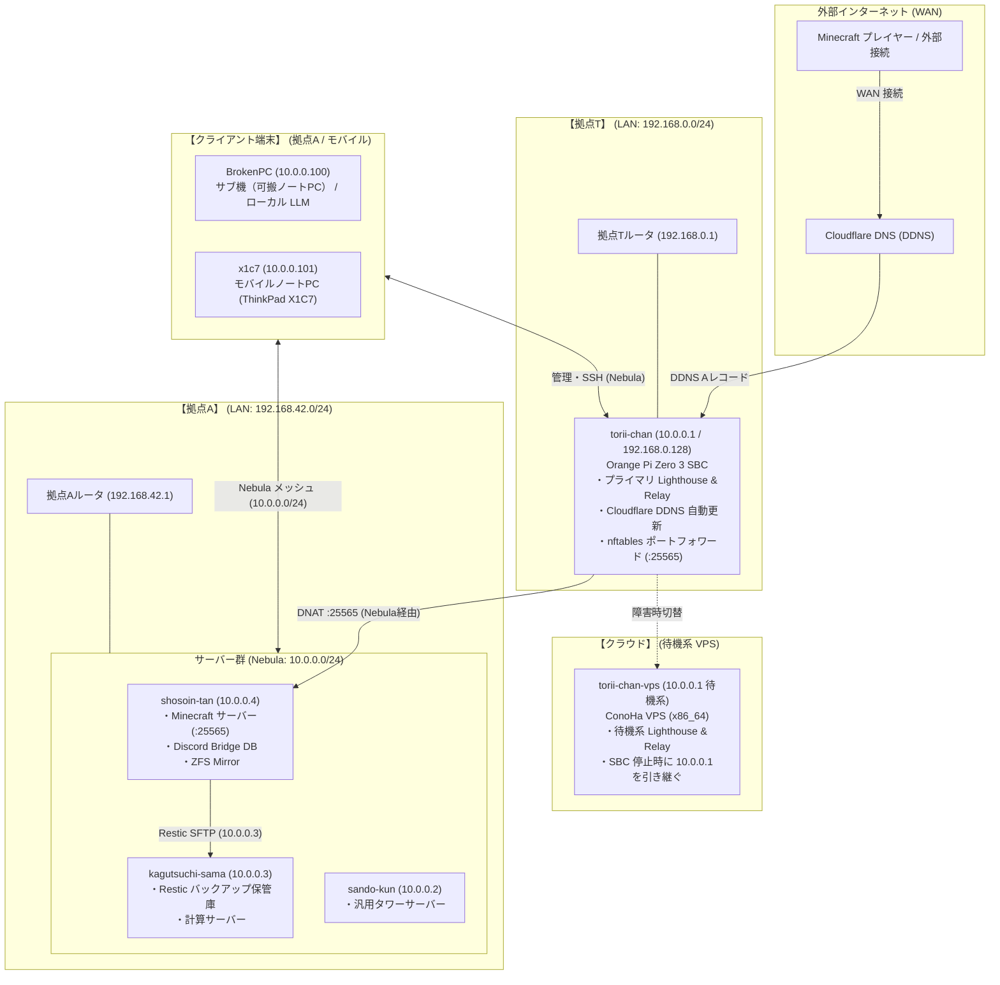

# ネットワークアーキテクチャ

本ドキュメントは，本リポジトリで管理されている全ホスト間のオーバーレイネットワーク（Nebula），拠点間（拠点T・拠点A・クラウド）の物理・論理トポロジ，WAN/LAN 接続経路，ポートフォワーディング，およびセキュリティ境界の設計仕様を記述する．

---

## 1. マルチサイト・ネットワーク全体トポロジ

本環境は **拠点T**（エッジゲートウェイ・Lighthouse），**拠点A**（サーバークラスタ・端末群），および **クラウド**（待機系 VPS）の複数拠点に分散しており，これらを **Nebula メッシュ VPN**（`10.0.0.0/24`, MTU 1320）でシームレスに相互接続している．クライアント端末（BrokenPC, x1c7）は拠点A LAN 内だけでなく，外部の公衆網（モバイル）からも Nebula を経由して安全にクラスタへ参加する．

---

## 2. Nebula IP アロケーション台帳

全ノードは `10.0.0.0/24` のプライベートアドレス空間に配置されている（正本: [`scripts/nebula-lib.sh`](../../scripts/nebula-lib.sh) の `FLEET` 定義）．

| ホスト名 | Nebula IP | 物理拠点 / 内部 LAN | ロール / グループ | 役割・用途 |
| :--- | :--- | :--- | :--- | :--- |
| **`torii-chan`** | `10.0.0.1` | **拠点T** (`192.168.0.128`) | `mgmt` | プライマリ Lighthouse & Relay，エッジゲートウェイ |
| **`sando-kun`** | `10.0.0.2` | **拠点A** (`192.168.42.x`) | `mgmt` | 汎用タワーサーバー（レガシー BIOS） |
| **`kagutsuchi-sama`** | `10.0.0.3` | **拠点A** (`192.168.42.x`) | `mgmt` | 計算サーバー，Restic リモートバックアップ保管庫 |
| **`shosoin-tan`** | `10.0.0.4` | **拠点A** (`192.168.42.x`) | `mgmt,app` | Minecraft サーバー，Discord Bridge，ZFS ストレージ |
| **`BrokenPC`** | `10.0.0.100` | **拠点A** / モバイル | `mgmt,app` | サブ機（可搬ノートPC），ローカル LLM 推論 |
| **`x1c7`** | `10.0.0.101` | **拠点A** / モバイル | `mgmt,app` | モバイルノートPC（ThinkPad X1C7） |
| **`torii-chan-vps`** | `10.0.0.1` (待機系) | **クラウド** (ConoHa VPS) | `mgmt` | 待機系 Lighthouse & Relay（SBC 停止時に 10.0.0.1 を引き継ぐ） |

---

## 3. 主要なネットワーク機構

### 3.1 メッシュネットワークの適用範囲と通信構造
- **適用範囲（スコープ）**: 本リポジトリが管理する全ノード（`10.0.0.0/24`）間でメッシュが構成され，外部インターネットや未登録端末とは完全に論理分離される．
- **透過的な暗号化通信**: ノード間の通信は自動的に最適な経路が選択される．同一 LAN（拠点A 内など）にあるノード間は直接通信し，拠点間など直接到達が困難な場合は Lighthouse / Relay（`torii-chan`）を経由して透過的に接続される．
- **高可用性構成**: プライマリ Lighthouse（`torii-chan`）に障害が発生した場合は，クラウド上の待機系 VPS（`torii-chan-vps`）へ切り替えることでメッシュ全体の接続性を維持する（詳細は [`../operations/vps-failover.md`](../operations/vps-failover.md) 参照）．

### 3.2 外部公開とポートフォワーディング
- 拠点Tの `torii-chan` 上で稼働する Cloudflare DDNS サービスが，動的グローバル IPv4 アドレスを検知して A レコード（`torii-chan.t3u.uk`, `mc.t3u.uk` 等）を自動更新する．
- 外部から届いた Minecraft トラフィック（TCP 25565）は，`torii-chan` の nftables により Nebula トンネルを経由して拠点Aの `shosoin-tan`（`10.0.0.4:25565`）へ安全に DNAT 転送される．

### 3.3 同一 LAN 内での直接接続と名前解決
- 拠点Tルータはヘアピン NAT（NAT Loopback）に正常対応しており，拠点内外を問わず同一の外部ドメイン（`torii-chan.t3u.uk`）でアクセス可能である．
- `torii-chan` と同一ルータ内に端末を配置する際，LAN 内のプライベート IP（`192.168.0.128`）で直接接続したい場合のために [`nixos/networking/local-network.nix`](../../nixos/networking/local-network.nix)（`/etc/hosts` 上書きオプション）が用意されている（通常運用時は全ホストで無効のままで問題ない）．

---

## 4. セキュリティ境界（Security Boundary）

1. **SSH の Nebula 閉じ込め**:
   - 拠点Aのサーバー群（`shosoin-tan`, `kagutsuchi-sama`, `sando-kun`）の SSH ポート 22 は，物理 LAN や外部 WAN からは遮断され，**`nebula0` インターフェース（`10.0.0.0/24`）経由のみ** リッスン・接続を許可している．
2. **ゾーン分離（Groups）**:
   - `mgmt`: 全ノードに付与される基本管理グループ．
   - `app`: アプリケーション通信（Minecraft，Discord Bridge，デスクトップ作業）を許可するグループ．
3. **証明書の有効期限と年次更新**:
   - Nebula ルート CA は 10年有効だが，各ノードの証明書は **1年有効** である．更新手順は [`../operations/secret-management.md`](../operations/secret-management.md) を参照．

---

## 関連ドキュメント
- [リポジトリ全体アーキテクチャ](overview.md)
- [シークレット & 証明書管理](../operations/secret-management.md)
- [VPS フェイルオーバー手順](../operations/vps-failover.md)
- [ネットワーク障害トラブルシューティング](../troubleshooting/network-recovery.md)
