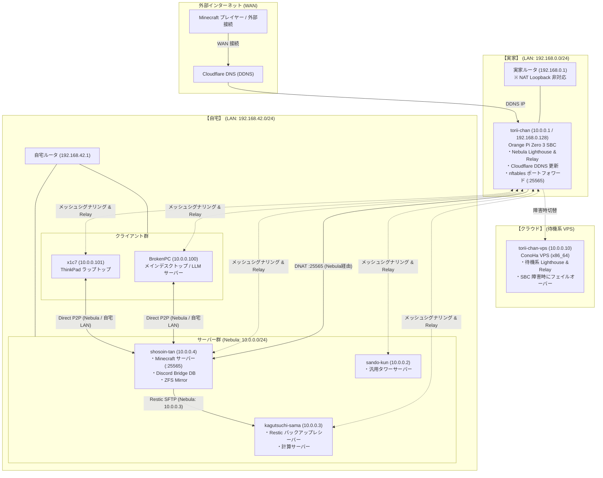

# ネットワークアーキテクチャ

本ドキュメントは，本リポジトリで管理されている全ホスト間のオーバーレイネットワーク（Nebula），拠点間（実家・自宅・クラウド）の物理・論理トポロジ，WAN/LAN 接続経路，ポートフォワーディング，およびセキュリティ境界の設計仕様を記述する．

---

## 1. マルチサイト・ネットワーク全体トポロジ

本環境は **実家**（エッジゲートウェイ・Lighthouse），**自宅**（サーバークラスタ・メイン端末群），および **クラウド**（待機系 VPS）の複数拠点に分散しており，これらを **Nebula メッシュ VPN**（`10.0.0.0/24`, MTU 1320）でシームレスに相互接続している．

---

## 2. Nebula IP アロケーション台帳

全ノードは `10.0.0.0/24` のプライベートアドレス空間に配置されている（正本: [`scripts/nebula-lib.sh`](../../scripts/nebula-lib.sh) の `FLEET` 定義）．

| ホスト名 | Nebula IP | 物理拠点 / 内部 LAN | ロール / グループ | 役割・用途 |
| :--- | :--- | :--- | :--- | :--- |
| **`torii-chan`** | `10.0.0.1` | **実家** (`192.168.0.128`) | `mgmt` | プライマリ Lighthouse & Relay，WAN ポートフォワードゲートウェイ |
| **`sando-kun`** | `10.0.0.2` | **自宅** (`192.168.42.x`) | `mgmt` | 汎用タワーサーバー（レガシー BIOS） |
| **`kagutsuchi-sama`** | `10.0.0.3` | **自宅** (`192.168.42.x`) | `mgmt` | 計算サーバー，Restic リモートバックアップ保管庫 |
| **`shosoin-tan`** | `10.0.0.4` | **自宅** (`192.168.42.x`) | `mgmt,app` | Minecraft サーバー，Discord Bridge，ZFS ストレージ |
| **`BrokenPC`** | `10.0.0.100` | **自宅** (`192.168.42.x`) | `mgmt,app` | メインワークステーション，ローカル LLM サーバー |
| **`x1c7`** | `10.0.0.101` | **自宅** / モバイル | `mgmt,app` | モバイルラップトップ（ThinkPad X1C7） |
| **`torii-chan-vps`** | `10.0.0.10` | **クラウド** (ConoHa VPS) | `mgmt` | 待機系フェイルオーバーゲートウェイ |

---

## 3. 主要なネットワーク機構

### 3.1 拠点間 P2P メッシュ通信と Relay
- **Lighthouse**: 実家に常設された `torii-chan`（`10.0.0.1`）がパブリック固定ポート（UDP 4242）を待ち受け，全ノード間の接続仲介（シグナリング）を行う．
- **Direct P2P**: 自宅 LAN 内（`192.168.42.0/24`）にあるノード同士（例: `BrokenPC` と `shosoin-tan`）は，UDP ホールパンチングにより同一 LAN 内の直接通信（Direct P2P）を行い，Lighthouse を経由せず超高速・低レイテンシで暗号化パケットを送受信する．
- **Relay**: 自宅と実家間など，NAT 背後同士で直接 P2P 疎通が困難な場合は，`torii-chan` が中継局（Relay）として機能する．

### 3.2 外部公開とポートフォワーディング
- 実家の `torii-chan` 上で稼働する Cloudflare DDNS サービスが，動的グローバル IPv4 アドレスを検知して A レコード（`torii-chan.t3u.uk`, `mc.t3u.uk` 等）を自動更新する．
- 外部から実家ルータ経由で `torii-chan` に届いた Minecraft トラフィック（TCP 25565）は，`torii-chan` の nftables により Nebula トンネルを経由して自宅の `shosoin-tan`（`10.0.0.4:25565`）へ安全に DNAT 転送される．

### 3.3 実家ルータの NAT Loopback 回避 (`local-network.nix`)
- **背景**: 実家に設置されている上位ルータ（`192.168.0.1`）は **NAT Loopback（ヘアピン NAT）** に対応していない．
- **課題**: そのため，実家 LAN（`192.168.0.0/24`）内の端末から外部ドメイン（`torii-chan.t3u.uk`）宛てに通信しようとすると，ルータ側でドロップして接続不能となる．
- **解決策**: 実家 LAN 内で稼働するホスト向けに [`nixos/networking/local-network.nix`](../../nixos/networking/local-network.nix) が用意されており，有効化すると `/etc/hosts` に `192.168.0.128 torii-chan.t3u.uk` を静的に登録してルータのヘアピンをバイパスする．
- **自宅ノードでの扱い**: 自宅（`192.168.42.0/24`）にあるサーバー群（`shosoin-tan`, `kagutsuchi-sama` 等）からは外部インターネット経由で `torii-chan.t3u.uk` へアクセスするため，このモジュールは**無効（コメントアウト）** になっている．

---

## 4. セキュリティ境界（Security Boundary）

1. **SSH の Nebula 閉じ込め**:
   - 自宅のサーバー群（`shosoin-tan`, `kagutsuchi-sama`, `sando-kun`）の SSH ポート 22 は，物理 LAN や外部 WAN からは遮断され，**`nebula0` インターフェース（`10.0.0.0/24`）経由のみ** リッスン・接続を許可している．
2. **ゾーン分離（Groups）**:
   - `mgmt`: 全ノードに付与される基本管理グループ．
   - `app`: アプリケーション通信（Minecraft，Discord Bridge，デスクトップ作業）を許可するグループ．
3. **証明書の有効期限と年次更新**:
   - Nebula ルート CA は 10年有効だが，各ノードの証明書は **1年有効** である．更新手順は [`../operations/secret-management.md`](../operations/secret-management.md) を参照．

---

## 関連ドキュメント
- [リポジトリ全体アーキテクチャ](overview.md)
- [シークレット & 証明書管理](../operations/secret-management.md)
- [VPS フェイルオーバー手順](../operations/vps-failover.md)
- [ネットワーク障害トラブルシューティング](../troubleshooting/network-recovery.md)
