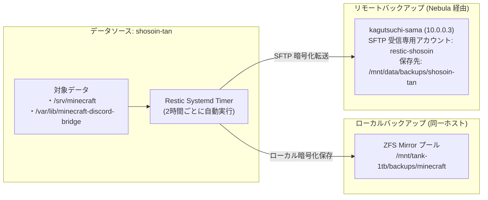

# バックアップ運用 & ディザスタリカバリ (DR)

本ドキュメントは，Restic および ZFS によるサーバーデータの多重バックアップ構成，日々の保守運用，およびシステム全損時の完全復旧（ディザスタリカバリ）手順を記述する．

---

## 1. バックアップアーキテクチャ

主要な永続データ（Minecraft ワールド，Discord Bridge DB）は，データ損失を防ぐため **ローカルストレージとリモートサーバーへの二重バックアップ** を行っている．



### バックアップ仕様
- **実行頻度**: 2 時間ごと（`systemd.timers`）
- **暗号化**: Restic 固有の暗号化パスワード（`secrets/services/backup.yaml` 内の `restic_password`）
- **保持世代ポリシー**:
  - `keep-daily: 7`（直近 7 日分）
  - `keep-weekly: 4`（直近 4 週分）
  - `keep-monthly: 6`（直近 6 ヶ月分）

---

## 2. 初期セットアップ手順 (`restic init`)

新しいバックアップ先を構築する際，またはリポジトリを初期化する際の手順である．

### 初期化の自動化と手動初期化
本リポジトリの Restic 設定（`nixos/services/backup/default.nix`）では `initialize = true` が有効化されているため，各サービスユニットの初回実行時にリポジトリは自動的に初期化（`restic init`）される．手動で初期化・検証を行う場合は以下のように実行する:

```bash
export RESTIC_PASSWORD=$(sudo cat /run/secrets/restic_password)

# ローカルリポジトリの初期化（手動確認時）
sudo -E restic -r /mnt/tank-1tb/backups/minecraft init

# リモート SFTP リポジトリの初期化（kagutsuchi-sama 宛て）
sudo -E restic -r sftp:restic-shosoin@10.0.0.3:/mnt/data/backups/shosoin-tan init
```

---

## 3. 日常の確認とスナップショット操作

### バックアップ状況の確認
```bash
# shosoin-tan 上で実行
systemctl status restic-backups-local-backup.service
systemctl status restic-backups-remote-backup.service
```

### スナップショット一覧の表示
```bash
# パスワード環境変数を読み込んでスナップショット一覧を確認
export RESTIC_PASSWORD=$(sudo cat /run/secrets/restic_password)

restic -r /mnt/tank-1tb/backups/minecraft snapshots
```

---

## 4. ディザスタリカバリ (DR) 手順

`shosoin-tan` のディスクが全損，またはマシン自体が失われた場合，`kagutsuchi-sama` のリモートバックアップから代替マシンへデータを完全復元する手順である．

### Step 1: 新規ホストの準備
[新ホスト追加手順](adding-a-host.md) に従い，代替ホストに NixOS を導入して Nebula メッシュ（`10.0.0.X`）へ接続する．

### Step 2: バックアップの取得・復元
1. **代替ホスト上で Restic を実行**:
   ```bash
   export RESTIC_PASSWORD="<バックアップパスワード>"
   export RESTIC_REPOSITORY="sftp:restic-shosoin@10.0.0.3:/mnt/data/backups/shosoin-tan"

   # 最新スナップショットの ID を確認
   restic snapshots

   # 指定したディレクトリへデータをリストア
   restic restore latest --target /tmp/restore
   ```
2. **データファイルの配置**:
   ```bash
   # Minecraft データの復元
   sudo mkdir -p /srv/minecraft
   sudo cp -r /tmp/restore/srv/minecraft/* /srv/minecraft/
   sudo chown -R minecraft:minecraft /srv/minecraft

   # Discord Bridge データの復元（サービス実行ユーザーは minecraft）
   sudo mkdir -p /var/lib/minecraft-discord-bridge
   sudo cp -r /tmp/restore/var/lib/minecraft-discord-bridge/* /var/lib/minecraft-discord-bridge/
   sudo chown -R minecraft:minecraft /var/lib/minecraft-discord-bridge
   ```
3. **サービスの起動確認**:
   ```bash
   sudo systemctl restart minecraft-server-lobby.service
   sudo systemctl restart minecraft-server-nitac23s.service
   sudo systemctl restart minecraft-discord-bridge.service
   ```

---

## 5. ZFS 保守運用 (`tank-1tb`)

`shosoin-tan` のローカルストレージは ZFS Mirror（`/mnt/tank-1tb`）で保護されている．

- **定期スクラブ**: 現在自動実行（systemd タイマー）は設定されていないため，定期的に手動でスクラブを実行する（詳細は [ZFS & ストレージ保守](../hardware/storage-zfs.md) を参照）．
- **手動スクラブ実行**: `sudo zpool scrub tank-1tb`
- **ステータス確認**: `zpool status tank-1tb`
- **ディスク交換・リビルド手順**: 詳細は [ZFS & ストレージ保守](../hardware/storage-zfs.md) を参照．

---

## 関連ドキュメント
- [ネットワークアーキテクチャ](../architecture/network-topology.md)
- [ZFS & ストレージ保守](../hardware/storage-zfs.md)
- [新ホスト追加手順](adding-a-host.md)
