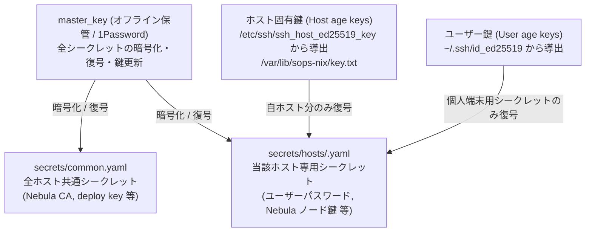

# シークレット & 鍵ライフサイクル管理

本ドキュメントは，SOPS（sops-nix），age，1Password，および Nebula 証明書による暗号化シークレットの管理方針，鍵モデル，年次更新手順，および失効・廃棄プロトコルを記述する．

---

## 1. 鍵階層とアクセスモデル

本リポジトリでは，最小権限の原則に基づき 3 種類の age 鍵を使い分ける．



| 鍵の種別 | 配置場所 | 権限範囲 | 用途 |
| :--- | :--- | :--- | :--- |
| **`master_key`** | 1Password / 管理者のオフライン端末 | 全ファイル復号・暗号化 | 新ホスト追加，鍵のローテーション，暗号化ファイルの編集 |
| **ホスト鍵** | `/var/lib/sops-nix/key.txt` | 自ホストの `secrets/hosts/<hostname>.yaml` のみ | 起動時の自動復号，サービス用クレデンシャル読み込み |
| **ユーザー鍵** | `~/.ssh/id_ed25519` | 開発環境の特定個人シークレット | ワークステーション上の開発ツール用認証情報 |

---

## 2. 秘密情報のファイル構成

- **`secrets/common.yaml`**:
  全ホストで共有される共通シークレット．Nebula ルート CA 秘密鍵，`nix-config-private` 取得用 GitHub デプロイ鍵，Cloudflare API トークン等を含む．
- **`secrets/hosts/<hostname>.yaml`**:
  ホスト個別のシークレット．ログインユーザーのハッシュ化パスワード，当該ホストの Nebula ノード秘密鍵等を含む．
- **`secrets/nebula/ca.crt`**:
  Nebula メッシュのルート CA 公開証明書（暗号化不要のリポジトリ公開ファイル）．

---

## 3. 日常のシークレット編集

シークレットの編集には `master_key` が必要である:
```bash
# master 鍵の環境変数を指定して編集
SOPS_AGE_KEY_FILE=~/.config/sops/age/keys.txt sops secrets/common.yaml

# ホスト個別シークレットの編集
SOPS_AGE_KEY_FILE=~/.config/sops/age/keys.txt sops secrets/hosts/<hostname>.yaml
```

---

## 4. 年次証明書更新（Nebula 証明書ローテーション）

Nebula のルート CA 証明書（`secrets/nebula/ca.crt`）は 10 年間有効だが，**各ノードに発行された証明書は 1 年間のみ有効** である（次回更新目安: 2027年8月）．

### 一括更新手順
クラスタ内の全ノード証明書を一括で再発行・更新するスクリプトが用意されている:
```bash
# 全ホストのノード証明書を再発行して secrets/hosts/*.yaml にインポート
scripts/nebula-rotate-ca.sh --nodes-only
```
更新後は `git commit` し，各ホストにデプロイを適用することでダウンタイムなしに新しい証明書へ切り替わる．

---

## 5. ホスト廃棄・再インストール時の鍵失効プロトコル

マシンを廃棄するか，OS をクリーン再インストールして SSH ホスト鍵が変わった場合，古い鍵へのアクセス権を速やかに剥奪する．

1. **`.sops.yaml` の編集**:
   - 廃棄するホストの公開鍵アンカー（`&<hostname> age1...`）および `creation_rules` から当該ホストを削除する．
2. **既存シークレットの再暗号化**:
   ```bash
   # 古い鍵で復号できないよう全ファイルを再暗号化
   SOPS_AGE_KEY_FILE=~/.config/sops/age/keys.txt sops updatekeys secrets/hosts/<hostname>.yaml
   ```
3. **不要シークレットファイルの削除**:
   ホストを完全破棄する場合は，`git rm secrets/hosts/<hostname>.yaml` を実行してコミットする．
4. **Nebula 台帳からの削除**:
   `scripts/nebula-lib.sh` の `FLEET` 配列から該当ホストのエントリを削除する．

---

## 関連ドキュメント
- [ネットワークアーキテクチャ](../architecture/network-topology.md)
- [新ホスト追加手順](adding-a-host.md)
- [トラブルシューティング: 認証・シークレット](../troubleshooting/secrets-and-auth.md)
