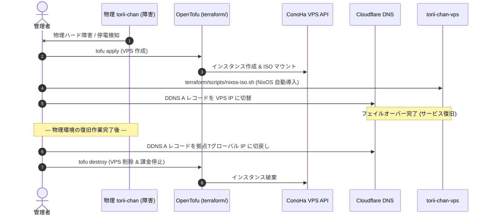

# ConoHa VPS プロビジョニング & フェイルオーバー手順

本ドキュメントは，物理エッジゲートウェイ（`torii-chan`）がハードウェア故障や長時間の停電等で停止した場合に，ConoHa VPS 上で待機系ゲートウェイ（`torii-chan-vps`）を立ち上げ，切替および物理復旧後の切戻し（Failback）を行う緊急時手順書（Runbook）である．

---

## 1. フェイルオーバー概要

平時は拠点Tの省電力 SBC（Orange Pi Zero 3）がエッジゲートウェイとして稼働している．物理障害が発生した際，必要時のみ ConoHa VPS（従量課金）を立ち上げることで，最低限のコストで高可用性を実現する．



---

## 2. フェイルオーバー起動手順 (Failover)

### Step 1: OpenTofu による VPS プロビジョニング
`terraform/` ディレクトリで VPS を作成する:
```bash
cd terraform
# 認証情報を SOPS から注入 (詳細は terraform/README.md 参照)
export CONOHAVPS_USER_ID=$(sops -d --extract '["OPENSTACK_USER_ID"]' ../secrets/services/conoha-vps-mcp.yaml)
export CONOHAVPS_TENANT_ID=$(sops -d --extract '["OPENSTACK_TENANT_ID"]' ../secrets/services/conoha-vps-mcp.yaml)
export TF_VAR_ssh_public_key='ssh-ed25519 ...'
tofu init
tofu apply
```
出力された VPS のインスタンス ID およびパブリック IP アドレスを確認する．

### Step 2: NixOS の導入 (ISO レスキュー)
レスキュー ISO をビルドし，ConoHa API 経由でアタッチして起動する:
```bash
# 一時パスワード付きレスキュー ISO をビルド
./hosts/torii-chan/build-vps-iso.sh

# レスキュー ISO のアタッチ・起動
./scripts/nixos-iso.sh install <instance_id> ./result-iso/iso/nixos-*.iso

# VNC コンソールで NixOS インストール後，ISO をイジェクト
./scripts/nixos-iso.sh eject <instance_id>
```

### Step 3: DNS 切替
Cloudflare ダッシュボード（または API）で，ドメインの A レコードを拠点T回線の IP から **VPS のパブリック IP** へ手動で切り替える．
（VPS 上の Cloudflare DDNS サービスが稼働開始すると，以降は自動更新される）．

---

## 3. 切戻し手順 (Failback & 課金停止)

拠点Tの物理 SBC（`torii-chan`）が復旧した後の切戻し手順である．

1. **拠点T SBC の疎通確認**:
   物理マシンを起動し，LAN 内および Nebula 内で `torii-chan`（10.0.0.1）が正常稼働していることを確認する．
2. **DNS の切戻し**:
   Cloudflare の A レコードを拠点Tのグローバル IP へ戻す．
3. **VPS の破棄**:
   不要になった VPS を即座に破棄し，課金を停止する:
   ```bash
   cd terraform
   tofu destroy
   ```
4. **ステートファイルの保全**:
   `terraform/terraform.tfstate` を安全にバックアップ・保管しておく．

---

## 関連ドキュメント
- [ネットワークアーキテクチャ](../architecture/network-topology.md)
- [Terraform モジュール仕様](../../terraform/README.md)
- [トラブルシューティング: ネットワーク](../troubleshooting/network-recovery.md)
