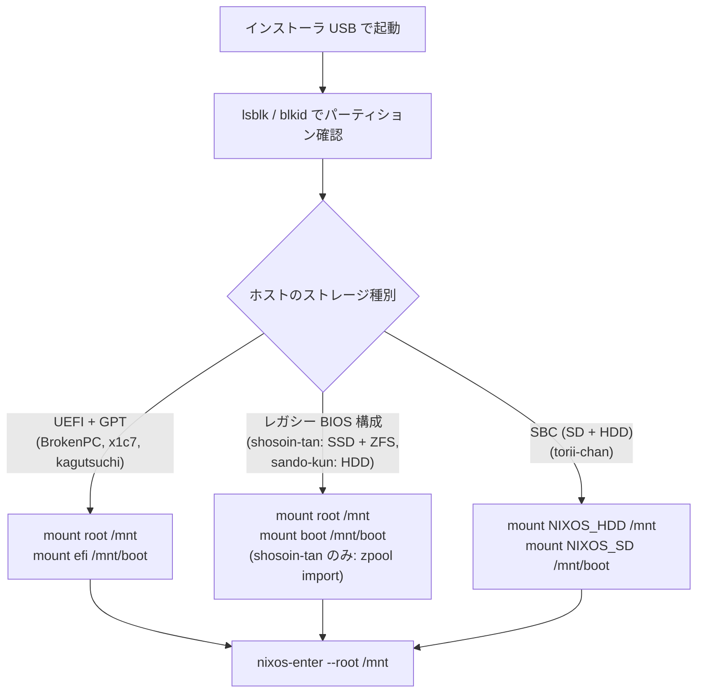

# 緊急時システム復旧・レスキューガイド

本ドキュメントは，システムの世代ロールバック手順，ブートローダーメニューでの旧世代選択，および起動不能に陥ったマシンを NixOS インストーラ USB からレスキューマウントして `nixos-enter` で復旧する手順を記述する．

---

## 1. 世代ロールバック手順

NixOS は過去のシステム構成世代（generation）を Nix ストア内に不変に保持しているため，設定適用ミスやカーネル不具合が発生した場合でも即座に以前の正常な状態へ復元できる．

### パターン A: 稼働中システムでのロールバック
設定変更の適用直後にサービスの起動失敗や不具合に気づいた場合:

```bash
# 1. 直前の世代へ瞬時に切り替え
sudo nixos-rebuild switch --rollback

# 2. 世代一覧の確認
nix-env -p /nix/var/nix/profiles/system --list-generations

# 3. 特定の世代番号（例: generation 42）へ切り替える場合
sudo /nix/var/nix/profiles/system-42-link/bin/switch-to-configuration switch
```

### パターン B: 起動時ブートローダーメニューでの世代選択
設定ミスやカーネル更新により OS が起動不能（カーネルパニック，systemd クラッシュ）になった場合，再起動時のブートローダーメニューから直接過去の世代を選択して起動する．

#### 1. GRUB メニュー（`BrokenPC`, `x1c7`, `kagutsuchi-sama`, `shosoin-tan`, `sando-kun`）
1. マシン起動時，マザーボードロゴが表示された直後に `Shift` キーまたは `Esc` キーを連打して GRUB メニューを表示させる．
2. メニューから「**NixOS - All configurations**」を選択して `Enter` を押す．
3. 過去の日時および世代番号の一覧が表示されるため，直前の正常に起動していた世代を選択して起動する．

#### 2. extlinux メニュー（`torii-chan` SBC / Orange Pi Zero 3）
1. HDMI ディスプレイまたは UART シリアルコンソールを接続して電源を投入する．
2. U-Boot のカウントダウン中に任意のキーを押し，extlinux 世代選択画面を表示する．
3. 過去の正常な世代エントリを選択して起動する（`/boot` は常に SD カード上の `NIXOS_SD` に保持されているため，HDD 側の不具合時でもメニューからブート可能）．

### 起動後の恒久化対応
旧世代を選択して起動しただけでは，次回の `nixos-rebuild switch` 時に再び不具合のある設定がビルド・適用されてしまう:
1. 不具合の原因となったコミットを特定し，`git revert` または設定修正を行う．
2. 修正した設定で再度スイッチを実行し，新たな健全世代を作成する:
   ```bash
   sudo nixos-rebuild switch --flake .#<hostname>
   ```

---

## 2. NixOS インストーラ USB によるレスキューマウントと nixos-enter

ブートローダー自体の破損，ストレージ設定の破壊，または秘密情報の復号失敗により起動メニューからも修復できない場合の最終復旧手順である．

### 事前準備
1. 公式 NixOS 最小インストーラ USB（またはカスタムインストーラ ISO）を用意し，対象マシンを USB ブートする．
2. インストーラ環境の root プロンプトに入る．

### ストレージ構成別マウント手順



#### 構成 A: UEFI + GPT マシン（`BrokenPC`, `x1c7`, `kagutsuchi-sama`）
```bash
# ルートおよび EFI パーティションのマウント
mount /dev/disk/by-id/<root-partition> /mnt
mount /dev/disk/by-id/<efi-partition> /mnt/boot
```

#### 構成 B: レガシー BIOS 構成（`shosoin-tan`: SSD + ZFS，`sando-kun`: HDD）
`shosoin-tan` は SSD 上に ext4 システム領域，2 台の HDD 上に ZFS Mirror（`tank-1tb`）を持つ．一方，`sando-kun` は HDD（ext4）のみで ZFS は非搭載である:
```bash
# ルートおよび boot のマウント
# 例: shosoin-tan（SSD）
mount /dev/disk/by-id/ata-CT480BX500SSD1_1946E3D7A95A-part3 /mnt
mount /dev/disk/by-id/ata-CT480BX500SSD1_1946E3D7A95A-part2 /mnt/boot

# 例: sando-kun（HDD）
# mount /dev/disk/by-id/ata-ST9250320AS_5SW1VK4F-part3 /mnt
# mount /dev/disk/by-id/ata-ST9250320AS_5SW1VK4F-part2 /mnt/boot

# shosoin-tan 固有手順: 必要に応じて ZFS プールを代替ルート指定で強制インポート（sando-kun では不要）
zpool import -f -R /mnt tank-1tb
```

#### 構成 C: Orange Pi Zero 3 SBC（`torii-chan-hdd`）
ルートは外付け HDD（`NIXOS_HDD`），`/boot` は SD カード（`NIXOS_SD`）に分かれている:
```bash
mount /dev/disk/by-label/NIXOS_HDD /mnt
mount /dev/disk/by-label/NIXOS_SD /mnt/boot
```

---

### nixos-enter による環境突入と復旧作業

ターゲットシステムの完全なコンテキストで chroot 環境に入る:
```bash
nixos-enter --root /mnt
```

#### 復旧操作 1: 秘密鍵と SOPS の整合性確認
暗号化シークレットの復号不全が原因の場合，鍵ファイルの存在とパーミッションを確認・修復する:
```bash
ls -la /var/lib/sops-nix/key.txt
# 存在しない場合は SSH ホスト鍵から再導出
mkdir -p /var/lib/sops-nix
ssh-to-age -private-key -i /etc/ssh/ssh_host_ed25519_key > /var/lib/sops-nix/key.txt
chmod 600 /var/lib/sops-nix/key.txt
```

#### 復旧操作 2: ブートローダーの強制再インストール
ブートセクタの破損や EFI 変数の欠落が発生している場合，ブートローダーを強制再インストールする:
```bash
NIXOS_INSTALL_BOOTLOADER=1 /nix/var/nix/profiles/system/bin/switch-to-configuration boot
```

#### 復旧操作 3: 特定の健全世代をブート既定に設定
```bash
# 過去の健全な世代番号（例: 35）を指定して boot 設定を更新
/nix/var/nix/profiles/system-35-link/bin/switch-to-configuration boot
```

#### 復旧操作 4: 設定の修正とリビルド（ネットワーク利用可能な場合）
```bash
cd /home/t3u/nix-config
nixos-rebuild boot --flake .#<hostname>
```

---

### レスキュー環境からの脱出と再起動

すべての修復作業が完了したら，環境を抜けてアンマウントする:
```bash
# 1. nixos-enter を抜ける
exit

# 2. マウント解除
umount -R /mnt

# 3. ZFS をインポートしていた場合のみエクスポート（shosoin-tan 固有）
zpool export tank-1tb

# 4. システム再起動
reboot
```

> [!CAUTION]
> **ZFS プール（`tank-1tb`）のエクスポート忘れに注意**
> `shosoin-tan` で ZFS プールをインポートした場合，レスキュー環境の再起動前に必ず `zpool export tank-1tb` を実行すること．`shosoin-tan` は `boot.zfs.forceImportRoot = false` が設定されているため，レスキュー完了時にエクスポートを怠ると次回起動時に Emergency Mode に陥る．


---

## 関連ドキュメント
- [シークレット・認証トラブルシューティング](secrets-and-auth.md)
- [ビルド・デプロイ障害トラブルシューティング](build-and-deploy.md)
- [Restic バックアップ & DR 復旧手順](../operations/backup-and-restore.md)
- [ZFS 保守・リビルドガイド](../hardware/storage-zfs.md)
- [Orange Pi Zero 3 ハードウェアガイド](../hardware/orange-pi-zero3.md)
