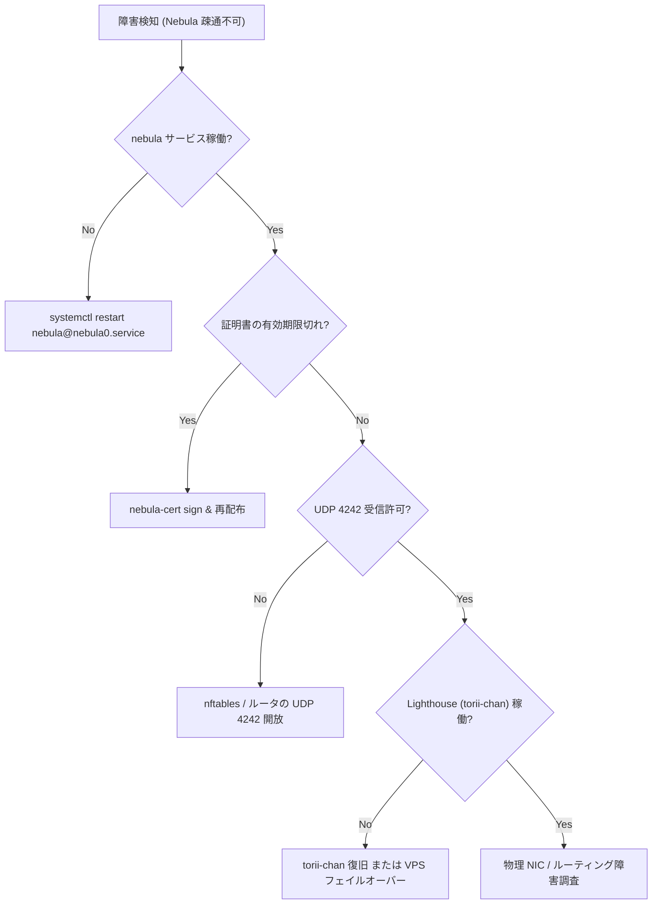
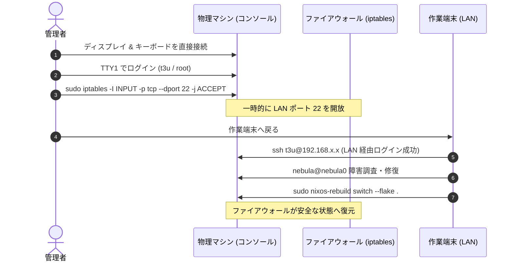

# ネットワーク障害トラブルシューティング

本ドキュメントは，Nebula メッシュ VPN の不通障害，および SSH 遮断発生時の物理コンソール経由での復旧手順を記述する．

---

## 1. Nebula メッシュ不通時の調査と復旧

### 現象・エラーメッセージ
- クラスター内ホストへの SSH 接続がタイムアウトする（例: `ssh t3u@10.0.0.X` で反応がない）．
- ping 疎通が通らない（`ping 10.0.0.X` で `Destination Host Unreachable`）．

### 原因の切り分け



### 復旧手順

#### Step 1: サービス稼働状況の確認
対象ホストで Nebula systemd ユニットの状態とログを確認する:
```bash
sudo systemctl status nebula@nebula0.service
sudo journalctl -u nebula@nebula0.service -e --no-pager
```

#### Step 2: 証明書有効期限の検証
Nebula ノード証明書は **1年更新** であるため，期限切れによるハンドシェイク拒否を確認する:
```bash
# 証明書の詳細確認（有効期限 Not After を検証）
nebula-cert print -path /etc/nebula/host.crt
```
期限切れの場合は，管理端末で証明書を再署名してシークレットを更新する:
```bash
CA_DIR="${CA_DIR:-$HOME/.nebula-ca}"

# ノード証明書の再発行
nebula-cert sign \
  -name "<hostname>" \
  -ip "10.0.0.X/24" \
  -groups "mgmt,..." \
  -ca-crt "$CA_DIR/ca.crt" \
  -ca-key "$CA_DIR/ca.key" \
  -out-crt "$CA_DIR/<hostname>.crt" \
  -out-key "$CA_DIR/<hostname>.key"

# SOPS へのインポート
SOPS_AGE_KEY_FILE=~/.config/sops/age/keys.txt bash scripts/nebula-import-secrets.sh "$CA_DIR"

git add secrets/hosts/<hostname>.yaml
git commit -m "fix(nebula): refresh certificate for <hostname>"
```

---

## 2. SSH 接続が拒否された場合の物理コンソール・ローカル接続手順

### 現象・エラーメッセージ
物理 LAN 内の別端末から SSH 接続を試行した際，以下のエラーとなり接続できない:
```text
ssh: connect to host 192.168.x.x port 22: Connection refused
```

### 原因
本リポジトリのタワーサーバー群（`tower-server` プロファイル）およびゲートウェイでは，セキュリティ強化のため [`nixos/profiles/tower-server/security.nix`](../../nixos/profiles/tower-server/security.nix) において:
```nix
networking.firewall.allowedTCPPorts = lib.mkForce [ ];
```
が設定されている．SSH ポート 22 は **Nebula インターフェース（`nebula0`, `trustedInterfaces`）経由でのみ許可** されており，LAN 側の物理インターフェースからはポート 22 へのアクセスがファイアウォールで遮断されている．このため，Nebula が停止すると物理 LAN からの SSH は一切不可となる．

### 物理コンソール経由での復旧手順



#### Step 1: 物理コンソール（TTY）の接続とログイン
1. 対象マシンに物理ディスプレイ（HDMI/DP）と USB キーボードを接続する．
2. 画面にローカルコンソール（TTY）を表示し，初期セットアップ時に設定したパスワードでログインする:
   - ユーザー: `t3u` または `root`
   - ※画面が真っ暗な場合は `Ctrl+Alt+F1` または `Ctrl+Alt+F2` を押す．

#### Step 2: 一時的なファイアウォール開放
作業端末から快適に操作できるよう，メモリ上のみで一時的にポート 22 を許可する（再起動や `switch` で自動的にリセットされるため安全）:
```bash
sudo iptables -I INPUT -p tcp --dport 22 -j ACCEPT
```

#### Step 3: 作業端末からのリモート復旧
作業端末から LAN IP（`192.168.x.x`）宛てに SSH 接続し，Nebula サービスを修復する:
```bash
# 作業端末から実行
ssh t3u@192.168.x.x

# Nebula ログ確認と再起動
sudo systemctl restart nebula@nebula0.service
sudo journalctl -u nebula@nebula0.service -e
```

#### Step 4: 恒久設定の再適用
原因を解消した後，通常通り設定を switch してファイアウォールを元のセキュアな状態に戻す:
```bash
sudo nixos-rebuild switch --flake .#<hostname>
```

---

## 関連ドキュメント
- [ネットワークアーキテクチャ設計](../architecture/network-topology.md)
- [VPS フェイルオーバー手順](../operations/vps-failover.md)
- [シークレット & 鍵ライフサイクル管理](../operations/secret-management.md)
- [Nebula モジュール実装](../../nixos/networking/nebula.nix)
- [タワーサーバー セキュリティ設定](../../nixos/profiles/tower-server/security.nix)
