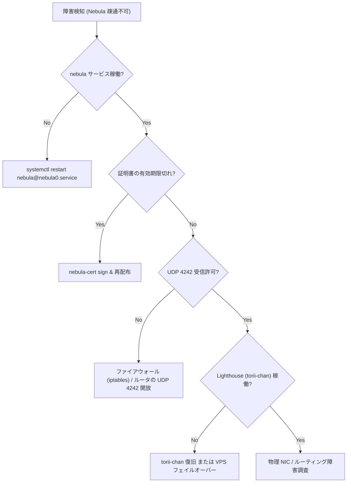
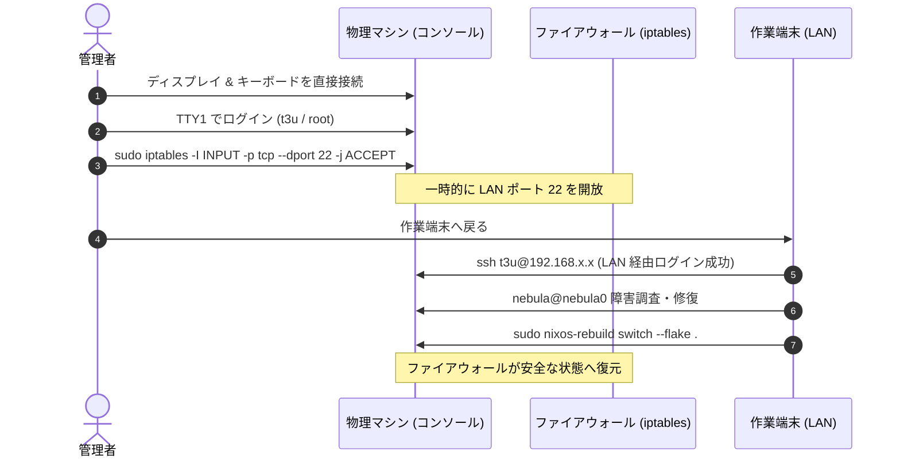

# ネットワーク障害トラブルシューティング

本ドキュメントは，Nebula メッシュ VPN の不通障害，SSH 遮断発生時の物理コンソール経由での復旧手順，および同一ルータ同居時の NAT loopback 回避手順を記述する．

---

## 1. Nebula メッシュ不通時の調査と復旧

### 現象・エラーメッセージ
- クラスター内ホストへの SSH 接続がタイムアウトする（例: `ssh t3u@10.0.0.X` で反応がない）．
- ping 疎通が通らない（`ping 10.0.0.X` で `Destination Host Unreachable`）．

### 原因の切り分け



### 復旧手順

#### Step 1: サービス稼働状況の確認
対象ホストで Nebula systemd ユニットの状態とログを確認する:
```bash
sudo systemctl status nebula@nebula0.service
sudo journalctl -u nebula@nebula0.service -e --no-pager
```

#### Step 2: 証明書有効期限の検証
Nebula ノード証明書は **1年更新** であるため，期限切れによるハンドシェイク拒否を確認する:
```bash
# 証明書の詳細確認（有効期限 Not After を検証）
nebula-cert print -path /run/secrets/*_nebula_cert
```
期限切れの場合は，管理端末で証明書を再署名してシークレットを更新する:
```bash
CA_DIR="${CA_DIR:-$HOME/.nebula-ca}"

# ノード証明書の再発行
nebula-cert sign \
  -name "<hostname>" \
  -ip "10.0.0.X/24" \
  -groups "mgmt,..." \
  -ca-crt "$CA_DIR/ca.crt" \
  -ca-key "$CA_DIR/ca.key" \
  -out-crt "$CA_DIR/<hostname>.crt" \
  -out-key "$CA_DIR/<hostname>.key"

# SOPS へのインポート
SOPS_AGE_KEY_FILE=~/.config/sops/age/keys.txt bash scripts/nebula-import-secrets.sh "$CA_DIR"

git add secrets/hosts/<hostname>.yaml
git commit -m "fix(nebula): refresh certificate for <hostname>"
```

---

## 2. SSH 接続が拒否された場合の物理コンソール・ローカル接続手順

### 現象・エラーメッセージ
物理 LAN 内の別端末から SSH 接続を試行した際，以下のエラーとなり接続できない:
```text
ssh: connect to host 192.168.x.x port 22: Connection refused
```

### 原因
本リポジトリのタワーサーバー群（`tower-server` プロファイル）およびゲートウェイ（`torii-chan`）では，セキュリティ強化のため物理 LAN 側からの SSH 接続が制限されている:

- **タワーサーバー群（`shosoin-tan`, `sando-kun`）**:
  [`nixos/profiles/tower-server/security.nix`](../../nixos/profiles/tower-server/security.nix) において:
  ```nix
  networking.firewall.allowedTCPPorts = lib.mkForce [ ];
  ```
  が設定されている．SSH ポート 22 は **Nebula インターフェース（`nebula0`, `trustedInterfaces`）経由でのみ許可** されており，LAN 側の物理インターフェースからはポート 22 へのアクセスがファイアウォールで遮断されている．
- **ゲートウェイ（`torii-chan`）**:
  [`nixos/services/gateway/firewall.nix`](../../nixos/services/gateway/firewall.nix) において `my.services.gateway.restrictAccess = true` が設定されている場合:
  ```nix
  allowedTCPPorts = if cfg.restrictAccess then lib.mkForce [ ] else [ 22 ];
  ```
  により物理ポート 22 が遮断される（`restrictAccess` が `false` の場合は LAN からの SSH が許可される）．

このため，Nebula が停止すると（あるいはゲートウェイで `restrictAccess = true` が有効な場合），物理 LAN 経由での SSH 接続は一切不可となる．

### 物理コンソール経由での復旧手順



#### Step 1: 物理コンソール（TTY）の接続とログイン
1. 対象マシンに物理ディスプレイ（HDMI/DP）と USB キーボードを接続する．
2. 画面にローカルコンソール（TTY）を表示し，初期セットアップ時に設定したパスワードでログインする:
   - ユーザー: `t3u` または `root`
   - ※画面が真っ暗な場合は `Ctrl+Alt+F1` または `Ctrl+Alt+F2` を押す．

#### Step 2: 一時的なファイアウォール開放
作業端末から快適に操作できるよう，メモリ上のみで一時的にポート 22 を許可する（再起動や `switch` で自動的にリセットされるため安全）:
```bash
sudo iptables -I INPUT -p tcp --dport 22 -j ACCEPT
```

#### Step 3: 作業端末からのリモート復旧
作業端末から LAN IP（`192.168.x.x`）宛てに SSH 接続し，Nebula サービスを修復する:
```bash
# 作業端末から実行
ssh t3u@192.168.x.x

# Nebula ログ確認と再起動
sudo systemctl restart nebula@nebula0.service
sudo journalctl -u nebula@nebula0.service -e
```

#### Step 4: 恒久設定の再適用
原因を解消した後，通常通り設定を switch してファイアウォールを元のセキュアな状態に戻す:
```bash
sudo nixos-rebuild switch --flake .#<hostname>
```

---

## 3. 同一ルータ同居時の名前解決障害と NAT loopback 回避

### 現象・エラーメッセージ
Lighthouse である `torii-chan` と同一ルータ（拠点T の LAN 内）に配置されたクライアント端末から，Lighthouse 宛ての通信や公開ドメイン解決で以下の障害が発生する:
- `torii-chan.t3u.uk:4242` 宛ての Nebula パケットが届かず，`Handshake timed out` が記録されて P2P トンネルが確立できない．
- 同一 LAN 内から公開ドメイン（`torii-chan.t3u.uk`，`mc.t3u.uk` 等）へのアクセス（SSH，Minecraft 接続等）がタイムアウトまたは Connection refused になる．
- `ping torii-chan.t3u.uk` では外部グローバル IP（WAN IP）が返るが，応答が得られない．

### 原因
多くの民生用ルータは **ヘアピン NAT（NAT Loopback）**（LAN 内端末がルータ自身の外部 WAN IP 宛てに送信したトラフィックを，再び LAN 内の特定ホストへ折り返す機能）に対応していないか，初期設定で無効化されている．この場合，同一 LAN 内の端末が公開 FQDN（`torii-chan.t3u.uk`）を解決してルータの外部 WAN IP へアクセスすると，パケットがルータ側で破棄される．

また，デュアルスタック環境において IPv6 アドレス解決や glibc のアドレスソートルール（RFC 3484/6724）の影響で IPv6 宛先が優先され，不通となるケースもある．

### 回避手順（`local-network.nix` の有効化）

[`nixos/networking/local-network.nix`](../../nixos/networking/local-network.nix) に用意されているローカルネットワーク最適化モジュールを有効化し，`/etc/hosts` 上でドメインを LAN 内プライベート IP へ直接解決させる．

#### Step 1: ホスト設定でのオプション有効化
同一ルータ内に同居するホストの `hosts/<hostname>/default.nix` において，`my.networking.local-network.enable` を有効化する:

```nix
my.networking.local-network = {
  enable = true;
  # torii-chan の LAN IP（既定値: 192.168.0.128）
  toriiChanIp = "192.168.0.128";
};
```

このオプションにより以下の設定が自動的に行われる:
1. **`/etc/hosts` 上書き**: `torii-chan.t3u.uk` が LAN IP（`192.168.0.128`）に直接紐付けられ，ルータの外部 WAN IP を経由しない直接通信が行われる．
2. **`gai.conf` による IPv4 優先化**: `/etc/gai.conf` に `precedence ::ffff:0:0/96 100` が注入され，glibc の名前解決において IPv4 が優先される．

#### Step 2: 設定の適用と検証
設定を反映し，名前解決が LAN IP に上書きされていることを確認する:

```bash
sudo nixos-rebuild switch --flake .#<hostname>

# 名前解決の確認（192.168.0.128 が返ることを確認）
getent hosts torii-chan.t3u.uk
```

名前解決が LAN IP に切り替わった後，Nebula の疎通（または対象ポートへの通信）が正常に行われることを確認する．

---

## 関連ドキュメント
- [ネットワークアーキテクチャ設計](../architecture/network-topology.md)
- [VPS フェイルオーバー手順](../operations/vps-failover.md)
- [シークレット & 鍵ライフサイクル管理](../operations/secret-management.md)
- [Nebula モジュール実装](../../nixos/networking/nebula.nix)
- [ローカルネットワーク最適化モジュール](../../nixos/networking/local-network.nix)
- [タワーサーバー セキュリティ設定](../../nixos/profiles/tower-server/security.nix)
- [ゲートウェイ ファイアウォール設定](../../nixos/services/gateway/firewall.nix)
