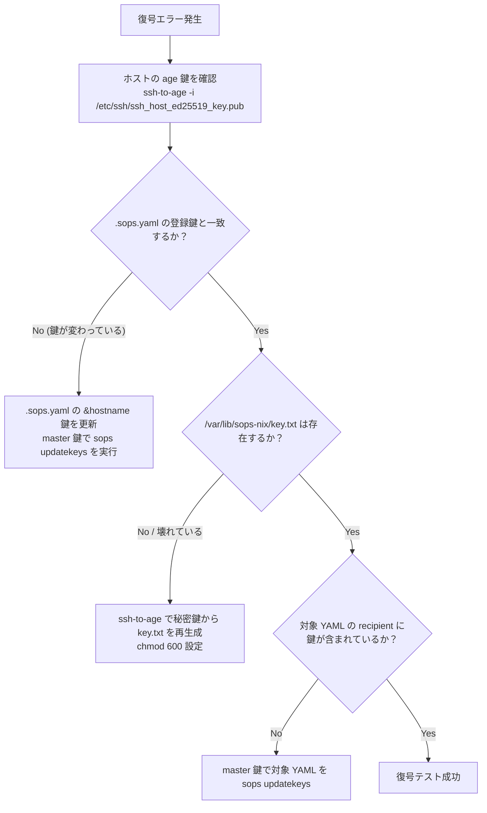

# シークレット・認証トラブルシューティング

本ドキュメントは，SOPS（sops-nix）復号エラー，プライベートリポジトリ（`nix-config-private`）の認証失敗，および activation スクリプト失敗による emergency mode 突入時の原因切り分けと脱出手順を記述する．

---

## 1. SOPS 復号失敗時の原因切り分け

### 現象・エラーメッセージ
- `sops-install-secrets: error: failed to decrypt ...`
- `Error decrypting file: None of the keys could decrypt the message`
- システムの activation 時に `activationScripts "0-sops-key-import" failed` または `sops-install-secrets.service` が失敗する．
- ユーザーのログイン時にパスワードが認識されない（`hashedPasswordFile` の読み込み失敗）．

### 原因
1. **ホスト秘密鍵の欠落・権限不正**: `/var/lib/sops-nix/key.txt` が存在しない，空である，または権限が `0600` 以外になっている．
2. **age 公開鍵の不一致**: マシンの再インストールやストレージ換装により `/etc/ssh/ssh_host_ed25519_key` が再生成され，そこから導出される age 鍵が `.sops.yaml` や暗号化ファイルの recipient と乖離している．
3. **recipient 更新漏れ**: 新ホストの公開鍵を `.sops.yaml` に追加したものの，`sops updatekeys` を実行しておらず，`secrets/common.yaml` や `secrets/hosts/<hostname>.yaml` の暗号化メタデータにホスト鍵が含まれていない．

### 切り分け・復旧手順



#### Step 1: ホストの age 公開鍵を確認
対象マシン上で SSH ホスト鍵から age 公開鍵を導出する:
```bash
sudo ssh-to-age -i /etc/ssh/ssh_host_ed25519_key.pub
# 出力例: age1...
```

#### Step 2: `.sops.yaml` の登録情報と突合
リポジトリルートの `.sops.yaml` を開き，Step 1 で得られた公開鍵と一致しているか確認する（アンカー名はハイフンがアンダースコア，例: `&shosoin_tan`, `&torii_chan`）:
```bash
grep -i -A 2 "&.*$(echo <hostname> | tr - _)" .sops.yaml
```
鍵が異なる場合（再インストール等），`.sops.yaml` の鍵記述を新しい公開鍵へ更新する．

#### Step 3: `/var/lib/sops-nix/key.txt` の確認・手動生成
[`nixos/security/sops.nix`](../../nixos/security/sops.nix) の activation スクリプト `0-sops-key-import` が何らかの理由で実行されなかった場合，手動で age 秘密鍵を配置する:
```bash
sudo mkdir -p /var/lib/sops-nix
sudo ssh-to-age -private-key -i /etc/ssh/ssh_host_ed25519_key | sudo tee /var/lib/sops-nix/key.txt >/dev/null
sudo chmod 600 /var/lib/sops-nix/key.txt
```

#### Step 4: master 鍵によるファイルの再暗号化
管理端末で `master_key` を指定し，該当ホストのシークレットおよび共通シークレットの recipient を更新する:
```bash
export SOPS_AGE_KEY_FILE=~/.config/sops/age/keys.txt

# ホスト個別ファイルと共通ファイルの更新
sops updatekeys secrets/hosts/<hostname>.yaml
sops updatekeys secrets/common.yaml

# recipients 整合性の検証（対象ホストの公開鍵が recipient に正しく反映されているか確認）
git diff secrets/common.yaml

# 変更をコミット
git add .sops.yaml secrets/hosts/<hostname>.yaml secrets/common.yaml
git commit -m "fix(secrets): update age recipients for <hostname>"
```

#### Step 5: 復号テスト
対象ホスト上で復号できることを確認する:
```bash
sudo SOPS_AGE_KEY_FILE=/var/lib/sops-nix/key.txt sops -d secrets/hosts/<hostname>.yaml
```

---

## 2. nix-config-private リポジトリ取得エラー

### 現象・エラーメッセージ
```text
ssh: Could not resolve hostname github-nix-config-private: No address associated with hostname
error: Failed to fetch git repository 'ssh://git@github-nix-config-private/t3u-tsu/nix-config-private'
```

### 原因
本リポジトリの `flake.nix` は，非公開の秘密 flake input として `git+ssh://git@github-nix-config-private/t3u-tsu/nix-config-private` を参照している．SSH エイリアス `github-nix-config-private` は [`nixos/base/private-config.nix`](../../nixos/base/private-config.nix) によって `/etc/ssh/ssh_config` に定義されるが，初回インストール時や未適用マシンでは root の SSH 設定にエイリアスが存在しないため，Flake 評価自体が失敗する（ブートストラップ時の鶏と卵の問題）．

### 復旧手順（初期ブートストラップ）

#### Step 1: root の SSH 環境の準備
Flake の評価および Git フェッチは root 権限で実行されるため，root の SSH 設定を初期化する:
```bash
sudo install -d -m 700 /root/.ssh
sudo ssh-keyscan -t ed25519 github.com 2>/dev/null | sudo tee -a /root/.ssh/known_hosts >/dev/null
```

#### Step 2: デプロイキーの配備
`secrets/common.yaml` に含まれる読み取り専用デプロイキーを抽出して配置する（`master_key` または既存の `/var/lib/sops-nix/key.txt` を使用）:
```bash
sudo bash -c 'SOPS_AGE_KEY_FILE=/var/lib/sops-nix/key.txt sops -d \
  --extract "[\"nix_config_private_deploy_key\"]" \
  secrets/common.yaml' \
  | sudo tee /root/.ssh/nix-config-private_deploy_key >/dev/null
sudo chmod 600 /root/.ssh/nix-config-private_deploy_key
```
> [!TIP]
> 作業端末から直接セットアップする場合は，作業機の SSH 秘密鍵（`~/.ssh/id_ed25519`）を一時的に `/root/.ssh/nix-config-private_deploy_key` へコピーして代用してもよい．

#### Step 3: 一時 SSH エイリアスの設定
```bash
sudo tee /root/.ssh/config >/dev/null <<'EOF'
Host github-nix-config-private
  HostName github.com
  User git
  IdentityFile /root/.ssh/nix-config-private_deploy_key
  IdentitiesOnly yes
EOF
```

#### Step 4: 疎通確認とシステム適用
```bash
sudo ssh -T git@github-nix-config-private   # "Hi t3u-tsu!" と表示されれば成功
sudo nixos-rebuild switch --flake .#<hostname>
```

#### Step 5: 一時設定のクリーンアップ
正常に世代が適用されると，[`nixos/base/private-config.nix`](../../nixos/base/private-config.nix) によりシステム全体（`/etc/ssh/ssh_config`）にエイリアスが恒久設定されるため，root の一時設定を削除する:
```bash
sudo rm /root/.ssh/config
```

---

## 3. activation スクリプト失敗で emergency mode に入った場合の脱出手順

### 現象・エラーメッセージ
システムの起動時や `nixos-rebuild switch` 実行時に activation スクリプトが非ゼロで終了し，ブートプロセスが中断して以下が表示される:
```text
You are in emergency mode. After logging in, type "journalctl -xb" to view system logs...
Give root password for maintenance (or press Control-D to continue):
```
> [!CAUTION]
> 本リポジトリでは [`nixos/base/user.nix`](../../nixos/base/user.nix) で `users.mutableUsers = false` が設定されており，root パスワードも SOPS 経由で設定される．シークレット復号失敗により emergency mode に入った場合，root パスワード自体が未設定となり，メンテナンスログインすら受け付けられない状態に陥る．

### 脱出・復旧手順

#### パターン A: メンテナンスログインが可能な場合
1. root パスワードを入力してシェルに入る．
2. 失敗ユニットとエラーログを特定する:
   ```bash
   systemctl --failed
   journalctl -xb -p 3
   ```
3. 直前の健全な世代へロールバックする:
   ```bash
   # 世代一覧を確認し，直前の健全な世代リンク（例: system-35-link）を指定して切り替える
   ls -d /nix/var/nix/profiles/system-*-link
   /nix/var/nix/profiles/system-<世代番号>-link/bin/switch-to-configuration switch
   ```

#### パターン B: パスワード入力が通らずログイン不能な場合（推奨回避策）

##### 第一選択肢: GRUB メニューからの正常世代ブート
最優先の復旧手段として，マシンを再起動してブートローダー（GRUB）メニューを表示し，**「NixOS - All configurations」から直前の正常な世代を選択して起動** する．正常世代でログインできた後，問題のあった設定を修正またはロールバックする．

##### 代替手段: `init=/bin/sh` 緊急シェルによる世代切り替え
GRUB メニューからの通常起動で解決しない場合，カーネルパラメータを変更して緊急シェルから前世代をブート既定に設定する:

1. マシンを強制再起動し，ブートローダー（GRUB）メニューを表示する．
2. 起動エントリを選択した状態で `e` キーを押し，エントリ編集画面に入る．
3. `linux /nix/store/.../bzImage` で始まる行の末尾に以下を追記する:
   ```text
   init=/bin/sh
   ```
   （または `systemd.unit=rescue.target`）
4. `Ctrl+X`（または `F10`）を押して直接ルートシェルを起動する．
5. ルートファイルシステムを書き込み可能で再マウントする:
   ```bash
   mount -o remount,rw /
   ```
6. 健全な過去の世代へ手動で切り替える:
   ```bash
   # 直前の世代リンクを確認
   ls -l /nix/var/nix/profiles/system-*-link
   # 前世代のブートスクリプトを実行（init=/bin/sh 環境では systemd がないため switch ではなく boot を指定）
   /nix/var/nix/profiles/system-<前世代番号>-link/bin/switch-to-configuration boot
   reboot -f
   ```

---

## 関連ドキュメント
- [シークレット & 鍵ライフサイクル管理](../operations/secret-management.md)
- [新ホスト追加手順](../operations/adding-a-host.md)
- [緊急時システム復旧・レスキューガイド](emergency-recovery.md)
- [SOPS 設計リファレンス](../../secrets/README.md)
- [SOPS モジュール実装](../../nixos/security/sops.nix)
- [プライベートリポジトリ認証モジュール](../../nixos/base/private-config.nix)
